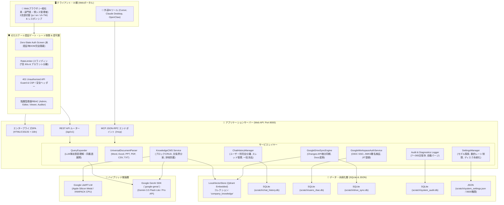

# 基本設計書：LiteRT-LM & Gemini ハイブリッド・ナレッジ管理・エージェント基盤 (Mac)

## 1. 基本情報

* **プロジェクト名**：GemmaCore_Mac
* **作成日**：2026-10-03
* **改定日**：2026-10-04
* **版数**：v4.4 (Enterprise Multi-Cloud & Security Hardened Edition)
* **ステータス**：APPROVED (APPR-009)
* **適用規程**：`docs/AUTONOMY.md` v2.0、`02_要件定義.md` v4.4

---

## 2. 全体アーキテクチャ図（v4.4）



---

## 3. ディレクトリ構成設計（v4.4）

```text
GemmaCore_Mac/
├── docs/                       # 設計書・仕様書・運用規程
│   ├── 01_企画書.md
│   ├── 02_要件定義.md
│   ├── 03_基本設計.md
│   ├── 04_技術設計.md
│   ├── 05_テスト仕様.md
│   ├── 06_GoogleWorkspace統合連携_企画提案・検討書.md
│   └── UPGRADE_NOTES.md
├── src/                        # コアソースコード
│   ├── auth/                   # 認証・認可・セキュリティ
│   │   ├── rbac.py             # SQLite永続化RBAC・委譲管理・ロックアウト
│   │   ├── rate_limiter.py     # スライディング窓・レートリミッター
│   │   ├── google_auth.py      # Google Workspace OIDC＆JWKS電子署名検証
│   │   └── audit_log.py        # ユーザー監査ログ & 保守診断ログ
│   ├── core/                   # 推論エンジン & チャット履歴
│   │   ├── engine.py           # InferenceEngine（ハイブリッド統合）
│   │   ├── conversation.py     # ConversationSession & 厳格モック
│   │   ├── gemini_provider.py  # Google GenAI SDK ネイティブプロバイダ
│   │   ├── chat_history.py     # ユーザー別チャット永続化 & 一括パージ
│   │   ├── settings.py         # リアルタイムモデル探索・動的レート制限・0600永続化
│   │   └── multimodal.py       # マルチモーダル入力ビルダー
│   ├── rag/                    # ナレッジ管理・RAG・クエリ展開
│   │   ├── query_expander.py   # LLMクエリ理解・意図解釈・同義語展開
│   │   ├── parser.py           # 万能ドキュメント抽出パーサー (Office/PDF)
│   │   ├── chunking.py         # 文境界優先チャンカー
│   │   ├── store.py            # LocalVectorStore (Qdrant CRUD & 排他防護)
│   │   ├── service.py          # KnowledgeCMSService (ブロック単位CRUD)
│   │   └── pipeline.py         # OfflineRAGPipeline (引用サプレッション)
│   ├── sync/                   # 外部データ同期基盤
│   │   └── drive_sync.py       # Google Drive Changes API増分同期＆Docsエクスポート
│   ├── harness/                # エージェント・ツール連携
│   │   ├── env.py              # ActionableSandboxEnv (EnvHarness)
│   │   ├── tools.py            # ToolRegistry
│   │   ├── runner.py           # EnvHarnessRunner
│   │   └── mcp_server.py       # Model Context Protocol (MCP) サーバー
│   └── web/                    # エンタープライズWebポータル
│       ├── app.py              # Webポータル・バックエンドAPIコントローラー
│       └── static/             # 認証ゲート・多言語・レスポンシブ統合UI
│           ├── index.html
│           ├── app.js
│           ├── style.css
│           ├── i18n.js         # 3言語辞書エンジン (ja / en / zh-TW)
│           ├── i18n_phrases.js # 全文・動的DOMフレーズテーブル
│           └── i18n_phrases_backend.js
├── scripts/                    # 運用・実行スクリプト群（macOS）
│   ├── setup_env.sh            # [macOS] 環境構築（Python 3.12 + Apple Silicon Metal）
│   ├── start_web.py            # [macOS] Webポータル起動スクリプト (Port 8000)
│   └── run_cli.py              # [macOS] CLI推論ラッパー
├── scratch/                    # 永続データベース（Git非同期）
│   ├── chat_history.db         # 会話履歴DB
│   ├── users_rbac.db           # ユーザー・権限・ロックアウトDB
│   ├── drive_sync.db           # Drive同期状態・ETag・トークンDB
│   ├── system_audit.db         # 監査・診断ログDB
│   └── system_settings.json    # システム設定ファイル（Mode: 0600）
├── tests/                      # テストスイート（全85件 100% PASS）
│   ├── test_security_audit_hardening.py # セキュリティ脆弱性・レート制限検証
│   ├── test_i18n.py                     # 3言語多言語化検証
│   ├── test_google_workspace_and_drive_sync.py # Google SSO & Drive同期検証
│   ├── test_delegated_rbac.py           # 階層型委譲RBAC検証
│   ├── test_lockout_and_idle_timeout.py # ロックアウト＆アイドル検証
│   └── ...
├── requirements.txt            # macOS推奨依存定義
└── README.md                   # 全体マニュアル
```

---

## 4. 主要コンポーネント設計（DES-008〜DES-026）

### 4.1 ハイブリッド推論 & リアルタイムモデル探索（DES-008/015）
* `InferenceEngine` に `provider` パラメータ（`"litert"` または `"gemini"`）を統合。
* `discover_live_models(api_key)`: Google Cloud APIへ問い合わせ、公開中の最新モデル一覧（ID、表示名、説明文、トークン上限）をリアルタイム取得。
* 設定値は `scratch/system_settings.json` へ即座に永続化され、再起動後も完全維持。

### 4.2 万能マルチフォーマット抽出パイプライン（DES-014）
* `UniversalDocumentParser`: Word (.docx), Excel (.xlsx), PowerPoint (.pptx), PDF (.pdf), CSV, TXT を一元解析。
* ページ番号・シート名・スライド番号を構造化メタデータ（Locator）として保持し、文境界優先チャンキングで即時ベクトル化。

### 4.3 ゼロステート認証ゲート & 多階層RBAC（DES-012）
* 未認証時は業務UIをDOMから完全隠蔽し、ログイン画面のみ露出。
* 全REST APIを `401 Unauthorized Guard` で完全保護。
* Admin / Editor / Viewer / Auditor の多階層権限制御。

### 4.4 ユーザー別チャット完全分離 & 一括パージ（DES-013）
* スレッドおよびメッセージを `user_id` で厳格に分離（他人のチャットは一切参照不可）。
* 「🗑️ 全ての会話履歴を削除」により、自己の全チャットをワンクリックで完全初期化。

### 4.5 RAG排他エンティティ制御 & 引用サプレッション（DES-016）
* 検索層で国名（日本・台湾等）や役職（大統領・総理大臣等）の排他判定を実施し、主語が異なる文書を検索段階で根本除外。
* ナレッジに記載がない質問には「社内ナレッジには、○○に関する記載はありません。」とだけ端的に答え、無関係な別対象の補足や参照リンクを完全サプレッション。

### 4.6 LLM事前クエリ理解 & 意図解釈・同義語展開エンジン（DES-017）
* `QueryExpander`: ユーザーの口語・略語質問（例: 「定期代」「テレワーク」）を受け取り、検索前にLLMが業務意図を把握して正式名称・同義語（「通勤手当」「在宅リモートワーク」）を展開。
* 多角ハイブリッド検索により表記揺れによる検索漏れを根絶しつつ、排他制御との併用によりゼロハルシネーションを堅持。
* WebUI吹き出し上部に `💡 意図理解: ...` の透明性タグを表示。

### 4.7 社員ライフサイクル管理 & エンタープライズ安全ガード（DES-018）
* `RBACManager`: ユーザー・役職・ステータスを SQLite（`scratch/users_rbac.db`）へ完全永続化。
* **入社手続き**: IDバリデーション、PBKDF2暗号化、ランダム初期PW発行、配布用初期ログイン案内文自動生成。
* **異動・昇格**: 氏名・所属部署・役職（Viewer ↔ Editor ↔ Admin）の即時変更、管理者によるパスワード安全再発行。
* **休職・退社**: ワンクリックで即座にログイン遮断＆セッション強制切断を行う「利用停止」機能、および完全抹消機能。
* **安全ガード**: 自身のアカウント削除・停止の禁止、唯一の管理者の削除・降格・停止の禁止、削除時の「ユーザーID入力確認」セーフティロック。

### 4.8 Google Workspace ハイブリッド統合認証（DES-019）
* `GoogleWorkspaceAuthService`: Google OIDC / OAuth 2.0 に基づくシングルサインオン（SSO）。
* **ドメイン制限**: Hosted Domain (`hd`) パラメータおよびIDトークン検証により社内Workspaceアカウントのみを厳格認可。
* **JITプロビジョニング**: 未登録の社内Googleユーザーの初回ログイン時、自動でユーザー作成（一般ユーザー権限: Viewerロール初期付与、役職・肩書は未設定/一般社員）。
* **ハイブリッド共存**: 内部PBKDF2認証とGoogle SSOを完全併用。

### 4.9 Google Drive 増分常時同期＆Docs自動エクスポート（DES-020）
* `GoogleDriveSyncEngine`: Google Drive API v3 の Changes API による増分差分同期。
* **ネイティブ変換**: Google Docs (`text/plain`), Google Sheets (`text/csv`), Google Slides (`text/plain`) を自動エクスポートし、`UniversalDocumentParser` で文境界優先チャンキング・Qdrantベクトル化。
* **削除自動パージ**: Drive上で削除・ゴミ箱移動されたファイルのチャンクを即座にQdrantから完全消去。
* **ETagキャッシュ**: ファイルハッシュ比較により無変更ファイルの再埋め込みをスキップ。

### 4.10 Google Drive 同期スコープ限定管理＆アクセス統制（DES-021）
* **ホワイトリスト制御**: 共有ドライブまたは特定フォルダIDのみを同期対象とし、私用・未確定ファイルの混入を防止。
* **権限連動**: 同期フォルダごとに閲覧可能ロール（Viewer / Editor / Admin）を指定し、RAG検索時にアクセス制御。
* **ダッシュボード**: WebUI上で同期進捗、最終同期日時、次回予定、変更件数を可視化し、「今すぐDriveと同期」ボタンを提供。

### 4.11 大企業向け階層型委譲アクセス制御（DES-022）
* **目的**: 1,000〜10,000人規模の大企業において、管理者の業務パンクを防ぎ、各部署の「編集長（Editor / 部門管理者）」が自部署の日常ユーザー管理を自律完結できる体制を構築する。
* **権限委譲マトリクス**:
  * 👑 **最高管理者（Admin）**: 全部署の全アカウント（Admin, Editor, Viewer）を作成・編集・削除可能。
  * ✏️ **編集長（Editor）**: 自部署を中心とした「閲覧者（Viewer）」「編集長（Editor）」のアカウント作成・編集・PW再発行・利用停止・削除が可能。
* **エンタープライズ安全統制**: 編集長によるAdmin昇格の禁止、Adminアカウントの操作禁止（管理者保護）、全社保守・監査ログ閲覧のAdmin専用維持。

### 4.12 ブルートフォース総攻撃防護（アカウントロックアウト）とセッションアイドル制御（DES-023）
* **連続5回認証失敗時の一時ロック**: `locked_until = now + 300`（5分間ロック）。ロック中はパスワード照合を行わずに直ちに403遮断。
* **即時アンロック**: 管理者および自部署の編集長が管理画面から即時アンロック可能。
* **セッション無操作アイドルタイムアウト**: APIリクエストごとに `session.touch()` で更新し、最終操作から30分無操作で401失効。

### 4.13 全画面多言語化（i18n）アーキテクチャ（DES-024）
* **3言語対応**: 日本語（`ja`）、英語（`en`）、繁体字中国語（`zh-TW`）。
* **UI切替 & 永続化**: ヘッダー・ログイン画面のドロップダウン、`localStorage`（`gcomm_lang`）保存、`languageChanged` イベントによるリアルタイム再描画。
* **辞書 & フレーズテーブル**: `i18n.js`（辞書キーバインディング）＋ `i18n_phrases.js`（DOM走査・MutationObserver・正規表現パターン）。
* **レイアウト保護**: `word-break: break-word`、`:lang(zh-TW)` 専用フォント・`line-height: 1.7`。

### 4.14 セキュリティ堅牢化・脆弱性防御アーキテクチャ（DES-025 / REQ-037）
* **開発用バックドア排除**: `POST /api/v1/auth/switch` を本番環境でデフォルト無効化（403 Forbidden）。
* **Google OIDC 電子署名検証**: `google.oauth2.id_token.verify_oauth2_token` によるGoogle公開鍵（JWKS）暗号署名検証を必須化（未署名JWT遮断）。
* **属性XSS（Stored DOM XSS）根絶**: インライン `onclick` 文字列結合を全廃し、`data-username` 属性とイベントデリゲーションへ完全移行。
* **ユーザー列挙・タイミング攻撃防御**: 存在しないユーザーに対してもダミーPBKDF2計算（100,000反復）を実行し、応答時間差による実在アカウント特定を遮断。
* **リクエストサイズ制限**: `MAX_PAYLOAD_SIZE = 25MB` 上限を設定し、413 Payload Too Large でOOM DoSを抑止。
* **センシティブ情報マスキング**: 一般社員（Viewer）への返却データから人事メモやロック状態を完全マスキング。
* **設定ファイル権限保護**: `system_settings.json` 保存時にパーミッション `0600`（所有者のみ読み書き）を強制設定。
* **セキュリティヘッダー**: レスポンスに `Content-Security-Policy`, `Permissions-Policy`, `X-Content-Type-Options: nosniff`, `X-Frame-Options: DENY`, `X-XSS-Protection: 1; mode=block` を送出。

### 4.15 大企業NAT対応・動的レート制限管理（DES-026 / REQ-038）
* **ログインAPIスライディングウィンドウ制限**: 60秒の移動窓でアクセスを追跡。超過時はレスポンスヘッダー `Retry-After: <秒数>`（最古記録消去までの残り時間）を正確に返却。
* **チャットAPIのアカウント単位分離**: 10,000人規模の大企業で単一共有IP（X-Forwarded-For）が使われる場合でも一括遮断が起きないよう、スロットリング基準を `session.username`（ログインアカウント）に分離。
* **リバースプロキシ対応**: `X-Forwarded-For` ヘッダーからオリジンクライアントIPを抽出する `_get_client_ip()` を実装。
* **管理画面からの動的設定**: `system_settings.json` および `/api/v1/settings`（GET/POST）により、`rate_limit_login`（デフォルト20）と `rate_limit_chat`（デフォルト60、0=無制限）をシステム再起動不要で即時変更可能。

---

## 5. 利用条件・免責事項

* **著作権**: 本リポジトリ内のソースコードおよび関連ドキュメントの著作権は作成者に帰属し、著作権の放棄はいたしません。
* **利用目的**: 本成果物は個人の研究・技術検証・学習目的のためにのみ公開されています。
* **商用・商標利用の禁止**: 商用目的での利用（再頒布・商用サービスへの組み込み等）および商標・ロゴ等の無断利用・流用を禁止します。
