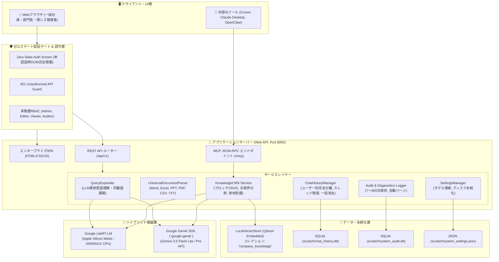

# 基本設計書：LiteRT-LM & Gemini ハイブリッド・ナレッジ管理・エージェント基盤

## 1. 基本情報

* **プロジェクト名**：GemmaCore_Mac
* **作成日**：2026-10-03
* **改定日**：2026-10-03
* **版数**：v4.2 (Enterprise i18n & Multi-language Readability Edition)
* **ステータス**：APPROVED (APPR-008)
* **適用規程**：`docs/AUTONOMY.md` v2.0、`02_要件定義.md` v4.2

---

## 2. 全体アーキテクチャ図（v3.6）



---

## 3. ディレクトリ構成設計（v3.6）

```text
GemmaCore_Mac/
├── docs/                       # 公式ドキュメント群（正本）
│   ├── 01_企画書.md
│   ├── 02_要件定義.md
│   ├── 03_基本設計.md
│   ├── 04_技術設計.md
│   ├── 05_テスト仕様.md
│   ├── RAG_ARCHITECTURE_COMPARISON.md
│   ├── AUTONOMY.md
│   ├── TASKS.md
│   ├── TRACEABILITY.md
│   ├── TEST_RESULTS.md
│   ├── DECISIONS.md
│   ├── ISSUES.md
│   └── HANDOFF.md
├── src/                        # コアソースコード
│   ├── auth/                   # 認証・認可・監査
│   │   ├── rbac.py             # 多階層RBAC & セッション管理
│   │   ├── audit_log.py        # ユーザー監査ログ & 保守診断ログ
│   │   └── sanitize.py         # ゼロトラストAPIキー秘匿・ログサニタイズ
│   ├── core/                   # 推論エンジン & チャット履歴
│   │   ├── engine.py           # InferenceEngine（ハイブリッド統合）
│   │   ├── conversation.py     # ConversationSession & 厳格モック
│   │   ├── gemini_provider.py  # Google GenAI SDK ネイティブプロバイダ
│   │   ├── chat_history.py     # ユーザー別チャット永続化 & 一括パージ
│   │   ├── settings.py         # リアルタイムモデル探索 & ディスク永続化
│   │   └── multimodal.py       # マルチモーダル入力ビルダー
│   ├── rag/                    # ナレッジ管理・RAG・クエリ展開
│   │   ├── query_expander.py   # 【新設】LLMクエリ理解・意図解釈・同義語展開
│   │   ├── parser.py           # 万能ドキュメント抽出パーサー (Office/PDF)
│   │   ├── chunking.py         # 文境界優先チャンカー (MuseGlimmerノウハウ)
│   │   ├── store.py            # LocalVectorStore (Qdrant CRUD & 排他防護)
│   │   ├── service.py          # KnowledgeCMSService (ブロック単位CRUD)
│   │   └── pipeline.py         # OfflineRAGPipeline (引用サプレッション)
│   ├── harness/                # エージェント・ツール連携
│   │   ├── env.py              # ActionableSandboxEnv (EnvHarness)
│   │   ├── tools.py            # ToolRegistry
│   │   ├── runner.py           # EnvHarnessRunner
│   │   └── mcp_server.py       # Model Context Protocol (MCP) サーバー
│   └── web/                    # エンタープライズWebポータル
│       ├── app.py              # Webポータル・バックエンドAPI
│   │   ├── auth/               # 認証・RBAC・社員ライフサイクル・Google SSO
│   │   │   ├── rbac.py         # SQLite永続化RBAC＆安全ガード
│   │   │   └── google_auth.py  # Google Workspace OIDC＆JITプロビジョニング
│   │   ├── sync/               # 外部データ同期基盤
│   │   │   └── drive_sync.py   # Google Drive Changes API増分同期＆Docsエクスポート
│   │   ├── core/               # LiteRT-LM & Gemini推論コア
│   │   ├── rag/                # 万能パーサー・文境界チャンキング・排他ベクトル検索・LLMクエリ展開
│   │   ├── mcp/                # MCP Server 実装
│   │   └── web/                # Webポータル REST API & 静的アセット
│   │       ├── app.py
│   │       └── static/         # 認証ゲート・同期ダッシュボード統合UI
│   │           ├── index.html
│   │           ├── app.js
│   │           └── style.css
│   ├── scripts/                # 運用スクリプト
│   │   ├── setup_env.sh        # 環境構築
│   │   ├── run_cli.py          # CLI推論
│   │   └── start_web.py        # Webポータル起動スクリプト (Port 8000)
│   ├── scratch/                # 永続データベース（Git非同期）
│   │   ├── chat_history.db     # 会話履歴DB
│   │   ├── users_rbac.db       # ユーザー・権限・ステータス永続化DB
│   │   ├── drive_sync.db       # Drive同期状態・ETag・トークンDB
│   │   ├── system_audit.db     # 監査・診断ログDB
│   │   └── system_settings.json # システム設定ファイル
│   ├── tests/                  # テストスイート（全55件）
│   └── README.md               # 全体マニュアル
```

---

## 4. 主要コンポーネント設計（DES-008〜DES-021）

### 4.1 ハイブリッド推論 & リアルタイムモデル探索（DES-008/015）
* `InferenceEngine` に `provider` パラメータ（`"litert"` または `"gemini"`）を統合。
* `discover_live_models(api_key)`: Google Cloud APIへ問い合わせ、公開中の最新モデル一覧（ID、表示名、説明文、トークン上限）をリアルタイム取得。
* 設定値は `scratch/system_settings.json` へ即座に永続化され、再起動後も完全維持。

### 4.2 万能マルチフォーマット抽出パイプライン（DES-014）
* `UniversalDocumentParser`: Word (.docx), Excel (.xlsx), PowerPoint (.pptx), PDF (.pdf), CSV, TXT を一元解析。
* ページ番号・シート名・スライド番号を構造化メタデータ（Locator）として保持し、文境界優先チャンキングで即時ベクトル化。

### 4.3 ゼロステート認証ゲート & 多階層RBAC（DES-012）
* 未認証時は業務UIをDOMから完全隠蔽し、ログイン画面のみ露出。
* 全REST APIを `401 Unauthorized Guard` で完全保護。
* Admin / Editor / Viewer / Auditor の多階層権限制御。

### 4.4 ユーザー別チャット完全分離 & 一括パージ（DES-013）
* スレッドおよびメッセージを `user_id` で厳格に分離（他人のチャットは一切参照不可）。
* 「🗑️ 全ての会話履歴を削除」により、自己の全チャットをワンクリックで完全初期化。

### 4.5 RAG排他エンティティ制御 & 引用サプレッション（DES-016）
* 検索層で国名（日本・台湾等）や役職（大統領・総理大臣等）の排他判定を実施し、主語が異なる文書を検索段階で根本除外。
* ナレッジに記載がない質問には「社内ナレッジには、○○に関する記載はありません。」とだけ端的に答え、無関係な別対象の補足や参照リンクを完全サプレッション。

### 4.6 LLM事前クエリ理解 & 意図解釈・同義語展開エンジン（DES-017）
* `QueryExpander`: ユーザーの口語・略語質問（例: 「定期代」「テレワーク」）を受け取り、検索前にLLMが業務意図を把握して正式名称・同義語（「通勤手当」「在宅リモートワーク」）を展開。
* 多角ハイブリッド検索により表記揺れによる検索漏れを根絶しつつ、排他制御との併用によりゼロハルシネーションを堅持。
* WebUI吹き出し上部に `💡 意図理解: ...` の透明性タグを表示。

### 4.7 社員ライフサイクル管理 & エンタープライズ安全ガード（DES-018）
* `RBACManager`: ユーザー・役職・ステータスを SQLite（`scratch/users_rbac.db`）へ完全永続化。
* **入社手続き**: IDバリデーション、PBKDF2暗号化、ランダム初期PW発行、配布用初期ログイン案内文自動生成。
* **異動・昇格**: 氏名・所属部署・役職（Viewer ↔ Editor ↔ Admin）の即時変更、管理者によるパスワード安全再発行。
* **休職・退社**: ワンクリックで即座にログイン遮断＆セッション強制切断を行う「利用停止」機能、および完全抹消機能。
* **安全ガード**:
  * 自身のアカウント削除・停止の禁止。
  * 唯一の管理者の削除・降格・停止の禁止（システムロックアウト防止）。
  * 削除時の「ユーザーID入力確認」セーフティロック（誤クリック防止）。
* **UI/UX**: 入社・異動・退社手順ガイドバナー、4大統計ダッシュボードカード、リアルタイム絞り込み検索ツールバー。

### 4.8 Google Workspace ハイブリッド統合認証（DES-019）
* `GoogleWorkspaceAuthService`: Google OIDC / OAuth 2.0 に基づくシングルサインオン（SSO）。
* **ドメイン制限**: Hosted Domain (`hd`) パラメータおよびIDトークン検証により社内Workspaceアカウントのみを厳格認可。
* **JITプロビジョニング**: 未登録の社内Googleユーザーの初回ログイン時、自動でユーザー作成（一般ユーザー権限: Viewerロール初期付与、役職・肩書は未設定/一般社員）。
* **ハイブリッド共存**: 内部PBKDF2認証とGoogle SSOを完全併用。管理画面からGoogleユーザーの権限変更・利用停止が可能。

### 4.9 Google Drive 増分常時同期＆Docs自動エクスポート（DES-020）
* `GoogleDriveSyncEngine`: Google Drive API v3 の Changes API による増分差分同期。
* **ネイティブ変換**: Google Docs (`text/plain`), Google Sheets (`text/csv`), Google Slides (`text/plain`) を自動エクスポートし、`UniversalDocumentParser` で文境界優先チャンキング・Qdrantベクトル化。
* **削除自動パージ**: Drive上で削除・ゴミ箱移動されたファイルのチャンクを即座にQdrantから完全消去。
* **ETagキャッシュ**: ファイルハッシュ比較により無変更ファイルの再埋め込みをスキップ。

### 4.10 Google Drive 同期スコープ限定管理＆アクセス統制（DES-021）
* **ホワイトリスト制御**: 共有ドライブまたは特定フォルダIDのみを同期対象とし、私用・未確定ファイルの混入を防止。
* **権限連動**: 同期フォルダごとに閲覧可能ロール（Viewer / Editor / Admin）を指定し、RAG検索時にアクセス制御。
* **ダッシュボード**: WebUI上で同期進捗、最終同期日時、次回予定、変更件数を可視化し、「今すぐDriveと同期」ボタンを提供。

### 4.11 大企業向け階層型委譲アクセス制御（DES-022）
* **目的**: 1,000〜10,000人規模の大企業において、管理者の業務パンクを防ぎ、各部署の「編集長（Editor / 部門管理者）」が自部署の日常ユーザー管理を自律完結できる体制を構築する。
* **権限委譲マトリクス**:
  * 👑 **最高管理者（Admin）**: 全部署の全アカウント（Admin, Editor, Viewer）を作成・編集・削除可能。
  * ✏️ **編集長（Editor）**: 自部署を中心とした「閲覧者（Viewer）」「編集長（Editor）」のアカウント作成・編集・PW再発行・利用停止・削除が可能。
* **エンタープライズ安全統制**:
  * **権限昇格の絶対禁止**: 編集長が「👑 管理者（Admin）」ロールを指定・付与することは不可（UI除外およびAPI 403遮断）。
  * **上位階層の不可侵・完全保護**: 編集長による「👑 管理者（Admin）」アカウントの編集・PWリセット・利用停止・削除は不可（UI「🔒 管理者保護」表示およびAPI 403遮断）。
  * **部署自律完結**: 新規登録時に編集長の所属部署が初期値として自動補完され、ミスなく自部署のアカウントを発行可能。
  * **全社保守・監査ログ保護**: システム設定（APIキー等）や全社監査ログ閲覧は管理者専用を厳格維持。

### 4.12 ブルートフォース総攻撃防護（アカウントロックアウト）とセッションアイドル制御（DES-023）
* **目的**: パスワード総当たり辞書攻撃や資格情報スタッフィング攻撃を水際で遮断し、離席時の未操作端末からの不正アクセスを防ぐ。
* **アカウントロックアウト制御（Account Lockout）**:
  * **失敗回数追跡**: ユーザーごとにパスワード照合失敗回数（`failed_attempts`）をDB記録。
  * **一時ロック発動**: 連続5回認証失敗時に `locked_until = time.time() + 300`（5分間ロック）を設定。
  * **ロック中の保護**: パスワード検証処理自体をバイパスして即座に 403 Forbidden で拒絶。残り時間（分・秒）を明示して利用者に案内。監査ログに `LOGIN_LOCKED`（BLOCKED）を記録。
  * **時間経過自動復帰**: 5分経過後はロック自動解除。正しいパスワードでログイン成功時に失敗カウントおよびロック期限を 0 にリセット。
  * **管理者・部門管理者による即時アンロック**:
    * 管理画面のユーザー一覧にロック状態を表示し、「🔓 ロック解除」ボタンを提供。
    * API `POST /api/v1/users/{username}/unlock` を配備。委譲RBACルールに基づき、Adminは全ロール、Editorは自部署のEditorおよびViewerを即時アンロック可能。
* **セッション無操作アイドルタイムアウト（Idle Timeout）**:
  * `UserSession`: ログイン時絶対有効期限（24時間）に加え、最終操作時刻（`last_activity_at`）を保持。
  * **アクティビティ更新**: 認証が必要な任意のAPIリクエスト処理時に `session.touch()` を実行し、タイムアウトカウンターを更新。
  * **自動失効**: 最後の操作から 30分（1,800秒）が経過したリクエストは `is_expired()` により即時セッション破棄・401 Unauthorized返却。
  * **UI誘導**: クライアント側でセッションタイムアウトを検知し、「無操作時間が30分を超えたため自動ログアウトしました」と明示してログイン画面へ復帰。


### 4.13 全画面多言語化（i18n）アーキテクチャ（DES-024 / REQ-036）

* **対応言語**：日本語（`ja`・既定）、英語（`en`）、繁体字中国語（`zh-TW`）。
* **言語切替UI**：ログイン画面カード右上およびヘッダーに言語選択ドロップダウン（🌐 日本語 / English / 繁體中文）を配備。
* **辞書・エンジン**：`src/web/static/i18n.js`（`window.i18n`）。`i18n.t(key, params)` で文言取得（未定義キーは日本語へフォールバック）、`setLanguage(lang)` で切替・`localStorage`（キー `gcomm_lang`）保存・DOM更新・`languageChanged` イベント発火。
* **DOMバインディング**：`data-i18n`（テキスト）、`data-i18n-html`（HTML）、`data-i18n-placeholder`、`data-i18n-title`。
* **動的UI**：トースト（認証成功・セッション失効等）は `i18n.t()` 経由。ロール表示は `languageChanged` で再描画。
* **レイアウト保護**：`word-break` / `overflow-wrap: break-word`、`:lang(zh-TW)` 専用フォント・`line-height: 1.7`、既存の `flex-wrap`・モーダルスクロール保護を維持。
* **全文翻訳方式（フレーズテーブル）**：`i18n_phrases.js` の `I18N_PHRASES`（日本語原文→[英,繁中]）と `I18N_PATTERNS`（補間文用の正規表現）を `i18n.tr()` が参照。DOMテキストノード/`placeholder`/`title` を走査して翻訳し、`MutationObserver` により動的生成行・トーストも自動翻訳。`confirm()`/`alert()` も翻訳。原文は保持され言語切替で再翻訳・日本語復帰が可能。
* **未翻訳として残る範囲**：ユーザー入力データ（氏名・部署等）、AI回答本文、サーバー由来の日本語エラーメッセージ、コピー用の初期ログイン案内文本文。
